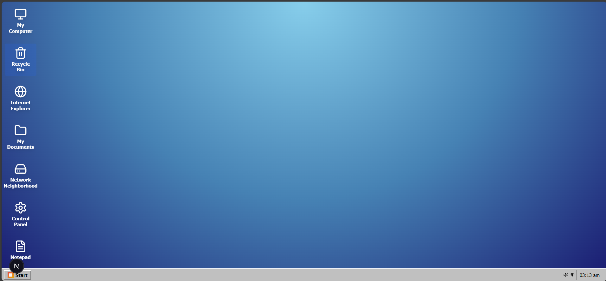
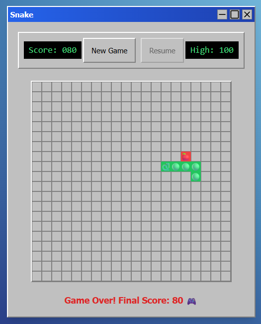
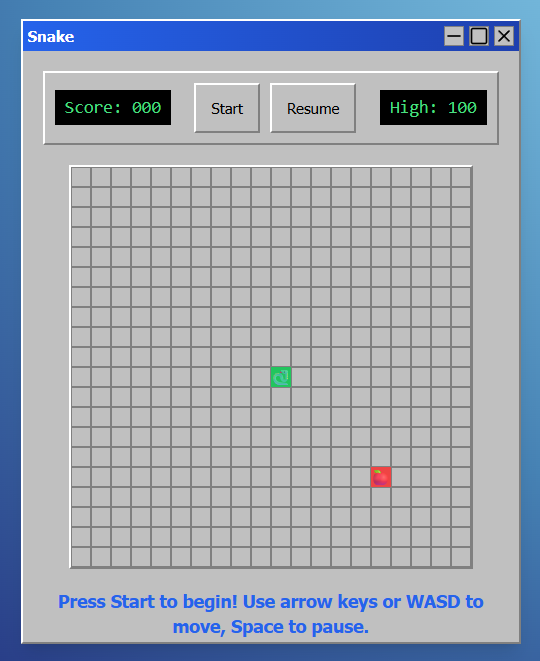

# 🖥️ Windows 98 Emulator

A nostalgic recreation of the classic Windows 98 desktop experience built with Next.js, React, and TypeScript. Complete with authentic styling, working applications, and classic games including the newly added Snake game!



## ✨ Features

### 🎮 **Classic Games**
- **Snake** - The classic arcade game with authentic controls and scoring
- **Minesweeper** - The beloved puzzle game with Windows 98 styling
- **Solitaire** - Classic card game experience
- **FreeCell** & **Hearts** - Additional card games (coming soon)

### 🛠️ **System Applications**
- **Notepad** - Simple text editor
- **Calculator** - Basic calculator functionality
- **Paint** - Drawing application
- **Internet Explorer** - Retro browser simulation
- **Control Panel** - System settings interface
- **File Explorer** - File system navigation

### 🎨 **Authentic Windows 98 Experience**
- **Pixel-perfect UI** - Authentic Windows 98 visual design
- **Start Menu** - Complete with Programs, Settings, and Games submenus
- **Taskbar** - With system tray and window management
- **Desktop Icons** - Double-click to launch applications
- **Window Management** - Drag, resize, minimize, maximize, and close windows
- **Retro Styling** - Classic gray color scheme and 3D button effects

## 🎮 Snake Game Features



### 🕹️ **Gameplay**
- Classic snake mechanics with growing body
- Food collection system (+10 points per apple)
- Collision detection for walls and self-collision
- Game over and restart functionality

### 🎯 **Controls**
- **Arrow Keys** - Move snake (Up, Down, Left, Right)
- **WASD Keys** - Alternative movement controls
- **Spacebar** - Pause/Resume game
- **Start Button** - Begin new game
- **Pause/Resume Button** - Game state control

### 🏆 **Scoring System**
- Real-time score tracking
- High score persistence (localStorage)
- Retro digital display styling

### 🎨 **Visual Design**
- Authentic Windows 98 game window styling
- 20x20 game grid with pixel-perfect rendering
- Snake head: 🐍 | Snake body: 🟢 | Food: 🍎
- Classic button styling with 3D effects

## 🚀 Getting Started

### Prerequisites
- Node.js 18+ 
- npm, yarn, or pnpm

### Installation

1. **Clone the repository**
```bash
git clone https://github.com/devvyyxyz/windows-98-site.git
cd windows-98-site
```

2. **Install dependencies**
```bash
npm install
# or
yarn install
# or
pnpm install
```

3. **Run the development server**
```bash
npm run dev
# or
yarn dev
# or
pnpm dev
```

4. **Open your browser**
Navigate to [http://localhost:3000](http://localhost:3000)

## 🎯 How to Play Snake



1. **Launch the game**
   - Double-click the Snake icon on desktop, OR
   - Start Menu → Programs → Games → Snake

2. **Start playing**
   - Click the "Start" button to begin
   - Use arrow keys or WASD to control the snake
   - Collect red apples to grow and increase score

3. **Game controls**
   - **Movement**: Arrow keys or WASD
   - **Pause**: Spacebar or Pause button
   - **New Game**: Start button (after game over)

4. **Objective**
   - Eat apples to grow your snake
   - Avoid hitting walls or your own body
   - Try to beat your high score!

## 📁 Project Structure

```
windows98-emulator/
├── app/                    # Next.js app directory
│   ├── globals.css        # Global styles
│   ├── layout.tsx         # Root layout
│   └── page.tsx          # Main page component
├── components/            # React components
│   ├── apps/             # Application components
│   │   ├── snake.tsx     # Snake game component
│   │   ├── minesweeper.tsx
│   │   ├── calculator.tsx
│   │   └── ...
│   ├── ui/               # UI components
│   ├── desktop.tsx       # Desktop component
│   ├── start-menu.tsx    # Start menu component
│   ├── taskbar.tsx       # Taskbar component
│   ├── window.tsx        # Window component
│   └── window-manager.tsx # Window management
├── hooks/                # Custom React hooks
├── lib/                  # Utility functions
├── public/              # Static assets
├── screenshots/         # Documentation screenshots
└── styles/             # Additional styles
```

## 🛠️ Technical Implementation

### Snake Game Architecture
- **React Hooks**: useState, useEffect, useCallback for game state
- **Game Loop**: setInterval-based movement system
- **Keyboard Events**: Global event listeners for controls
- **Local Storage**: High score persistence
- **Collision Detection**: Efficient boundary and self-collision checking

### Windows 98 Styling
- **Tailwind CSS**: Utility-first styling approach
- **Custom Colors**: Authentic Windows 98 color palette
- **3D Effects**: CSS borders for raised/pressed button effects
- **Typography**: Tahoma font family for authenticity

## 📸 Screenshots

Replace these placeholder names with your actual screenshots:

- `screenshots/windows98-desktop.png` - Main desktop view
- `screenshots/start-menu-games.png` - Start menu with Games submenu
- `screenshots/snake-game-interface.png` - Snake game window
- `screenshots/snake-game-playing.png` - Snake game in action
- `screenshots/minesweeper-game.png` - Minesweeper game
- `screenshots/calculator-app.png` - Calculator application
- `screenshots/all-windows-open.png` - Multiple windows demonstration

## 🎨 Customization

### Adding New Games
1. Create component in `components/apps/your-game.tsx`
2. Add to window manager in `components/window-manager.tsx`
3. Add to start menu in `components/start-menu.tsx`
4. Configure window settings in `hooks/use-windows.ts`

### Styling Modifications
- Modify `app/globals.css` for global styles
- Update Tailwind classes for component-specific styling
- Customize colors in component files

## 🤝 Contributing

1. Fork the repository
2. Create a feature branch (`git checkout -b feature/amazing-feature`)
3. Commit your changes (`git commit -m 'Add amazing feature'`)
4. Push to the branch (`git push origin feature/amazing-feature`)
5. Open a Pull Request

## 📝 License

This project is open source and available under the [MIT License](LICENSE).

## 🙏 Acknowledgments

- Inspired by the classic Windows 98 operating system
- Built with modern web technologies for nostalgic experience
- Thanks to the React and Next.js communities

## 🐛 Known Issues

- Some applications are placeholder implementations
- Mobile responsiveness needs improvement
- Audio effects not yet implemented

## 🔮 Future Enhancements

- [ ] Sound effects for games and system events
- [ ] More classic Windows 98 games (Pinball, Hearts)
- [ ] File system simulation
- [ ] Network neighborhood functionality
- [ ] Screensavers
- [ ] System sounds and startup sequence

---

**Enjoy your nostalgic journey back to 1998! 🎉**
